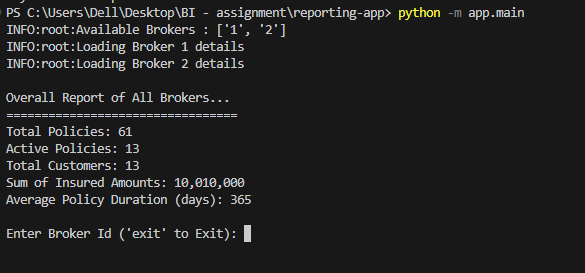

# Insurance Policy Data Aggregation and Normalization Tool

## Overview

This project is a command-line tool designed to aggregate insurance policy data from multiple brokers, normalize the data into a consistent format, and provide basic insights into the aggregated policies. The solution standardizes data from different brokers that offer data in varying formats and provides reports on policy counts, customers, insured amounts, and policy durations.

## How to Execute

    1. Clone the repository
    2. Required python libraries - pytest, pytest-cov, readable_number, pandas
    3. To run the Command line tool - execute - "python -m app.main" from reporting-app directory.
    4. To run the tests run - "pytest .\app\test\PolicyAnalyzerTest.py --cov=app.PolicyAnalyzer --cov-report=term-missing"
    This command will run tests and will give a coverage report for the app.PolicyAnalyzer module

## Strategy and Approach

### 1. Data Ingestion

The tool is built to handle data from multiple brokers. For this task, CSV files representing mock data from two brokers are ingested. The files are read using pandas, a powerful data manipulation library. The system expects the data to be in different column formats, which it addresses through a mapping system.

#### Why this approach?

Flexibility: By allowing for custom mappings between broker column names and standardized field names, the system can handle various data formats seamlessly.
Robust error handling: It anticipates potential errors such as missing files, incorrect data formats, and incorrect broker IDs to ensure smooth operation.

### 2. Data Normalization

Once data is ingested, it's normalized to a consistent structure using predefined column mappings for each broker. The columns are renamed according to these mappings, and missing data is filled with default values.

The approach guarantees that every policy has the same essential fields like PolicyNumber, InsuredAmount, StartDate, EndDate, and others, even if they were originally presented differently across brokers.
Why this approach?

- Consistency: By standardizing column names and filling missing values with default entries, the system ensures uniformity, allowing for easier aggregation and analysis.
  Extensibility: New brokers can be integrated by providing an additional column mapping, without requiring major changes to the codebase.

### 3. Data Aggregation

After normalization, the data from all brokers is aggregated into a collection of Policy objects. These objects are structured to hold policy data in a consistent manner, enabling easy processing.

The policies can then be filtered and analyzed based on the broker and the policy's status (active or expired).
Why this approach?

- Object-Oriented Design: By using an object model (Policy class), the tool represents the insurance data as real-world entities, making the code more modular and maintainable.
  Scalability: This approach can easily handle a growing dataset from multiple brokers while maintaining performance.

### 4. Basic Reporting

The tool calculates basic insights into the aggregated policies, including:

- Total count of active policies
- Number of distinct customers
- Total insured amount
- Average policy duration in days.
- Additionally, it can filter and display policies based on broker ID.

#### Why this approach?

- Clear Metrics: The reporting features are designed to provide clear and actionable insights, which are essential for monitoring policy data and making business decisions.
- Efficiency: The use of simple aggregation techniques (such as summing insured amounts or counting customers) ensures the tool can generate reports efficiently, even as data grows.

### 5. Unit Testing

The project is equipped with unit tests to ensure the functionality of key components like data ingestion, normalization, aggregation, and reporting.

The pytest framework is used for testing, and coverage is targeted for functions that process data, handle edge cases, and compute aggregate results.

#### Why this approach?

- Reliability: Automated tests ensure the integrity of the tool as new features or data sources are added. Testing helps catch bugs early, especially when changes to data structures or broker mappings are made.

- Maintainability: Unit tests provide documentation for the expected behavior of the system and serve as a safeguard against regressions.

## Results

